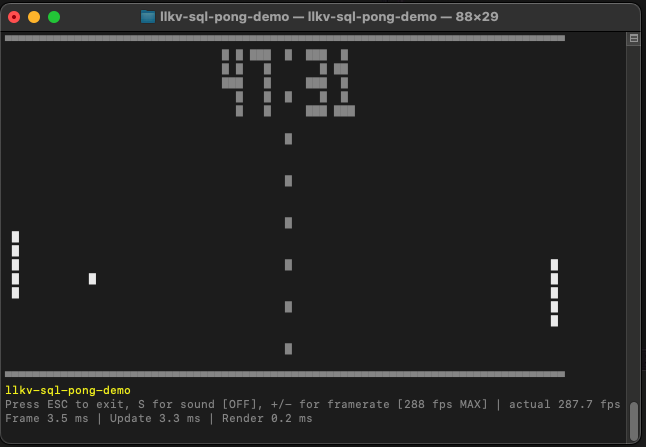

# LLKV SQL Pong Demo App

[![made-with-rust][rust-logo]][rust-src-page]
[![rust-docs][rust-docs-badge]][rust-docs-page]
[![Ask DeepWiki][deepwiki-badge]][deepwiki-page]

A terminal UI (TUI) app that plays a game of Pong against itself.

Most of the game logic is implemented in SQL so this demo can be used to evaluate and benchmark the SQL engine in the [LLKV](../../) toolkit.

## Quick Start

Run the demo from the workspace root:

```bash
cargo run -p llkv-sql-pong-demo --release
```

### Controls

- **ESC**: Quit the game
- **S**: Toggle sound effects (score beeps and paddle hits)
- **+**: Double framerate (30 → 60 → 120 → MAX)
- **-**: Halve framerate (back down to 15 FPS minimum)
- **MAX mode**: Shows actual FPS the SQL engine can deliver (no frame limiting)

### Performance Notes

The framerate controls let you stress-test LLKV's query execution speed:

- **30 FPS** (default): Smooth gameplay, ~33ms per frame
- **60 FPS**: Increased pace, ~16ms per frame
- **120 FPS**: Fast-paced action, ~8ms per frame
- **MAX mode**: Removes frame limiting to measure full-speed execution (typically 200-600+ FPS depending on hardware). The UI performs incremental updates to minimize terminal rendering overhead, though the engine can execute SQL queries faster than any terminal can physically refresh.

Each frame executes a complete SQL query with multiple subqueries handling "AI" decisions, physics, collision detection, and scoring. The framerate controls make this demo useful for benchmarking SQL execution performance under different workloads, though MAX mode measures end-to-end loop time including UI rendering.

> **Note:** Compiling for release mode (`--release`) will give **much** better framerates. Debug builds are significantly slower.




## Attribution

This code is a modified version of [https://github.com/Zeutschler/duckdb-pong-in-sql](https://github.com/Zeutschler/duckdb-pong-in-sql), ported to Rust, and the SQL queries have been substantially modified along the way.

## License

Licensed under the [Apache-2.0 License](../../LICENSE).

[rust-src-page]: https://www.rust-lang.org/
[rust-logo]: https://img.shields.io/badge/Made%20with-Rust-black?&logo=Rust

[deepwiki-page]: https://deepwiki.com/jzombie/rust-llkv
[deepwiki-badge]: https://deepwiki.com/badge.svg
