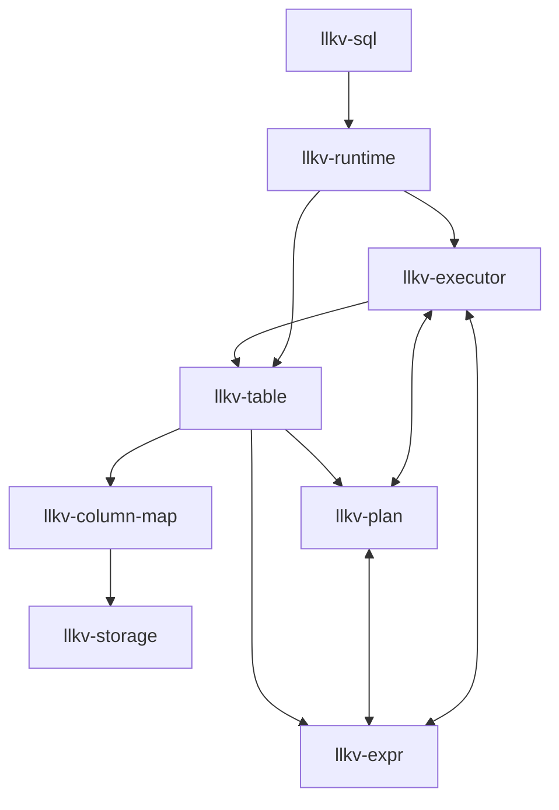

# High Level Crate Overview

This draft diagram provides a simplistic, high-level picture of how the primary crates relate; we will layer in the remaining crates as the documentation matures.

> Arrows indicate build dependencies flowing from higher-level crates down to their foundations. This intentionally omits several workspace crates; it is a simplistic connection diagram meant to convey the main lineage from `llkv-storage` through `llkv-runtime` up to `llkv-sql` for high-level documentation purposes.
